# Plan de Desarrollo: Aplicación de Gestión de Compras y Códigos Presupuestales

## 1. Resumen

Aplicación web para gestionar Órdenes de Compra (OC) y Códigos Presupuestales (CP) con un sistema de roles, permisos flexibles, y funcionalidades de gestión de cuenta de usuario.

## 2. Arquitectura y Tecnologías

*   **Arquitectura General:** Aplicación web multi-página.
*   **Backend:**
    *   Runtime: Node.js
    *   Framework: Express
    *   Lenguaje: TypeScript
    *   Descripción: API RESTful para gestionar datos y lógica de negocio.
*   **Frontend:**
    *   Librería: React
    *   Lenguaje: TypeScript
    *   Estilos: Tailwind CSS
    *   Descripción: Interfaz de usuario interactiva integrada en una estructura multi-página.P
*   **Base de Datos:** PostgreSQL
*   **Autenticación:** JSON Web Tokens (JWT)

## 3. Funcionalidades Clave

*   **Gestión de Usuarios:**
    *   Auto-registro (estado inicial: activo o pendiente según se defina).
    *   Login / Logout.
    *   Recuperación de contraseña olvidada.
    *   Cambio de contraseña (usuario logueado).
    *   Gestión de Perfil: Editar nombre, email. Subir/cambiar foto de perfil.
    *   Configuración de Notificaciones: Preferencias para activar/desactivar tipos de notificación.
*   **Roles y Permisos:**
    *   Roles base: Administrador, Compras, Usuario.
    *   Sistema de permisos detallados asignables (potencialmente más allá del rol base).
    *   Gestión de usuarios y sus roles/permisos por Administrador.
*   **Códigos Presupuestales (CP):**
    *   CRUD completo gestionado por Administrador y Compras.
    *   Campos: Nombre (único), Descripción, Monto Presupuesto, Fecha Inicio Vigencia, Fecha Fin Vigencia.
    *   Asignación de CP específicos a Usuarios (gestionado por Admin/Compras).
*   **Órdenes de Compra (OC):**
    *   Creación por Usuarios (seleccionando uno de sus CP asignados).
    *   Campos: Solicitante (auto), CP, Fecha Creación (auto), Descripción, Monto, Proveedor (opcional), Estado (inicial: 'Nueva').
    *   Flujo de Estados: Nueva -> En Revisión (por Compras) -> Aprobada / Rechazada (por Compras).
    *   Visualización: Usuarios ven sus OC. Compras ve todas las OC. Admin ve todas las OC.
    *   Cierre/Eliminación: Admin/Compras pueden cerrar/eliminar directamente. Usuarios pueden 'Solicitar Cierre', que Compras debe aprobar para pasar a 'Cerrada'.
*   **Notificaciones:**
    *   Sistema de notificaciones internas (dentro de la app).
    *   Eventos notificables: Cambio de estado de OC, asignación de CP, solicitud de cierre, etc.
    *   Implementación inicial: **Polling** (frontend consulta periódicamente al backend).
    *   Visualización: Indicador de notificaciones no leídas, lista/desplegable de notificaciones.

## 4. Modelo de Datos (PostgreSQL - Diagrama Mermaid)

```mermaid
erDiagram
    USUARIO ||--o{ ORDEN_COMPRA : "crea"
    USUARIO {
        int id PK
        string nombre
        string email UK "Unique"
        string password_hash
        string estado "pendiente, activo, inactivo"
        string avatar_url "Nullable"
        jsonb preferencias_notificaciones "Nullable, ej: {'oc_aprobada': true, 'nueva_asignacion_cp': false}"
        string reset_password_token "Nullable"
        timestamp reset_password_expires "Nullable"
        timestamp fecha_creacion
    }

    ROL {
        int id PK
        string nombre "Administrador, Compras, Usuario"
    }

    PERMISO {
        int id PK
        string clave "ej: crear_oc, ver_todas_oc, gestionar_cp"
        string descripcion
    }

    USUARIO_ROLES {
        int usuario_id PK, FK
        int rol_id PK, FK
    }

    ROL_PERMISOS {
        int rol_id PK, FK
        int permiso_id PK, FK
        boolean asignado "Para flexibilidad"
    }

    CODIGO_PRESUPUESTAL {
        int id PK
        string nombre UK "Unique"
        string descripcion
        decimal monto_presupuesto
        date fecha_inicio_vigencia
        date fecha_fin_vigencia
        timestamp fecha_creacion
        timestamp fecha_actualizacion
    }

    USUARIO_CODIGOS_PRESUPUESTALES {
        int usuario_id PK, FK
        int cp_id PK, FK
        timestamp fecha_asignacion
    }

    ORDEN_COMPRA {
        int id PK
        int usuario_id FK "Solicitante"
        int cp_id FK "Código presupuestal"
        date fecha_creacion
        string descripcion
        decimal monto
        string proveedor "Opcional"
        string estado "Nueva, EnRevision, Aprobada, Rechazada, Cerrada, CierreSolicitado"
        timestamp fecha_actualizacion
        int usuario_actualizacion_id FK "Quien actualizó por última vez"
    }

    NOTIFICACION {
        int id PK
        int usuario_id FK "Destinatario"
        string tipo_evento "ej: OC_APROBADA, NUEVO_CP_ASIGNADO"
        string mensaje
        boolean leida
        timestamp fecha_creacion
        string url_relacionada "Nullable, ej: /ordenes/123"
    }


    USUARIO ||--|{ USUARIO_ROLES : "tiene"
    ROL ||--|{ USUARIO_ROLES : "contiene"
    ROL ||--|{ ROL_PERMISOS : "define"
    PERMISO ||--|{ ROL_PERMISOS : "es parte de"
    USUARIO ||--o{ USUARIO_CODIGOS_PRESUPUESTALES : "se le asigna"
    CODIGO_PRESUPUESTAL ||--o{ USUARIO_CODIGOS_PRESUPUESTALES : "es asignado a"
    CODIGO_PRESUPUESTAL ||--o{ ORDEN_COMPRA : "financia"
    USUARIO ||--o{ ORDEN_COMPRA : "actualiza"
    USUARIO ||--o{ NOTIFICACION : "recibe"

    note "Modelo de datos final para la aplicación."
```

## 5. Próximos Pasos

1.  Configurar la estructura inicial del proyecto (Backend y Frontend).
2.  Implementar la conexión a la base de datos y las migraciones iniciales.
3.  Desarrollar la autenticación (registro, login, JWT).
4.  Implementar gradualmente los módulos CRUD y la lógica de negocio asociada.