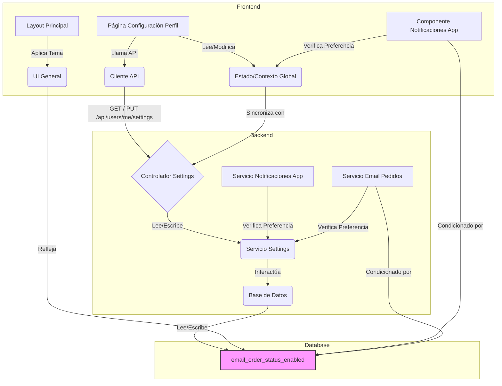

# Plan de Implementación: Configuraciones de Perfil de Usuario

**Objetivo:** Permitir a los usuarios personalizar su experiencia visual (tema claro/oscuro) y sus preferencias de notificación (en la app y por correo electrónico para estados de pedido).

**Plan de Implementación:**

1.  **Modificaciones en la Base de Datos (PostgreSQL):**
    *   **Opción A (Recomendada):** Crear una nueva tabla `user_settings` relacionada uno a uno con la tabla `usuarios`. Esto mantiene la tabla `usuarios` más limpia y facilita la adición de futuras configuraciones.
        *   `user_id` (FK a `usuarios.id`, PK)
        *   `theme` (VARCHAR(10) o ENUM('light', 'dark'), default: 'light')
        *   `app_notifications_enabled` (BOOLEAN, default: true)
        *   `email_order_status_enabled` (BOOLEAN, default: true)
    *   **Opción B:** Añadir las columnas directamente a la tabla `usuarios`.
        *   `theme` (VARCHAR(10) o ENUM('light', 'dark'), default: 'light')
        *   `app_notifications_enabled` (BOOLEAN, default: true)
        *   `email_order_status_enabled` (BOOLEAN, default: true)
    *   *Consideración:* Usaremos `timestamp without time zone` para las fechas como vimos antes, pero estas configuraciones no requieren columnas de fecha directamente.

2.  **Desarrollo del Backend (API):**
    *   Crear nuevos endpoints en la API para gestionar las configuraciones del usuario:
        *   `GET /api/users/me/settings`: Obtiene las configuraciones del usuario autenticado actualmente.
        *   `PUT /api/users/me/settings`: Actualiza las configuraciones del usuario autenticado. El cuerpo de la solicitud contendrá las configuraciones a modificar (ej: `{ "theme": "dark", "email_order_status_enabled": false }`).
    *   Implementar la lógica en los controladores y servicios correspondientes para leer y escribir estas configuraciones en la base de datos.
    *   Asegurar que estos endpoints requieran autenticación.

3.  **Desarrollo del Frontend (React/UI):**
    *   Crear una nueva página o sección dedicada a "Configuración de Perfil" o "Ajustes" accesible para el usuario logueado (probablemente dentro del `UserLayout`).
    *   Diseñar e implementar los componentes de UI necesarios:
        *   Un selector (ej: botones, switch) para elegir entre tema "Claro" y "Oscuro".
        *   Un interruptor (switch/checkbox) para habilitar/deshabilitar "Notificaciones en la aplicación".
        *   Un interruptor (switch/checkbox) para habilitar/deshabilitar "Recibir correos sobre el estado de mis pedidos".
    *   Implementar la lógica del componente:
        *   Al cargar la página, llamar al endpoint `GET /api/users/me/settings` para obtener las configuraciones actuales y mostrar los valores correctos en la UI.
        *   Cuando el usuario cambie una configuración, llamar al endpoint `PUT /api/users/me/settings` con el valor actualizado.
        *   Para el cambio de tema, aplicar el estilo visual (ej: añadiendo/quitando la clase `dark` al elemento `<html>` o `<body>`) inmediatamente después de la selección del usuario y de la confirmación exitosa de la API.

4.  **Integración Funcional:**
    *   **Tema:** El componente principal de la aplicación (`App.tsx` o el layout principal) deberá leer la configuración del tema (posiblemente desde un contexto o estado global que se inicializa con los datos del usuario) y aplicar la clase CSS correspondiente.
    *   **Notificaciones en la App:** El sistema que gestiona las notificaciones push o en la app deberá consultar la configuración `app_notifications_enabled` del usuario antes de enviar/mostrar una notificación.
    *   **Notificaciones por Correo:** El servicio del backend encargado de enviar correos electrónicos sobre el estado de los pedidos deberá verificar la configuración `email_order_status_enabled` del usuario antes de proceder con el envío.

**Diagrama de Flujo:**

**Próximos Pasos:**

1.  **Implementación:** Proceder con la implementación del plan. Se sugiere cambiar al modo "Code" para empezar a escribir el código necesario (migraciones de base de datos, endpoints de API, componentes de UI).