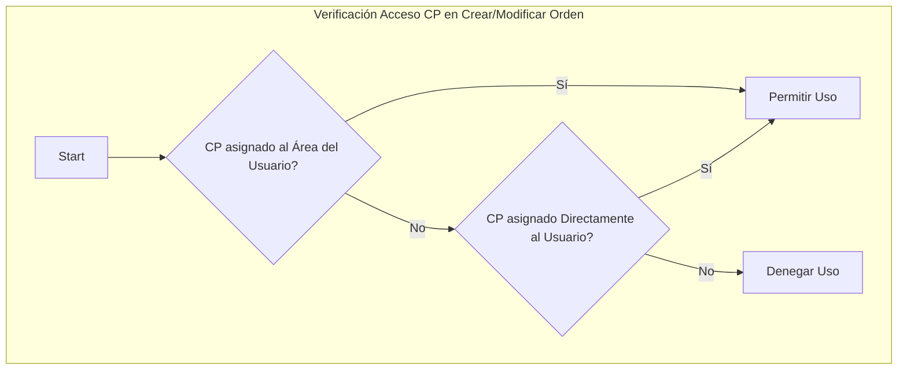

# Plan V3: Códigos Presupuestales y Solicitudes/Órdenes de Compra

**Objetivo:** Refinar y robustecer la funcionalidad de gestión de códigos presupuestales y el flujo de solicitudes/órdenes de compra, asegurando la correcta gestión del presupuesto, manteniendo un historial detallado y permitiendo asignaciones de presupuesto flexibles.

**Fases:**

## 1. Consolidación y Expansión de la Base de Datos

*   **Acción 1:** Eliminar la tabla `area_codigos_presupuestales`.
    *   **Justificación:** Eliminar redundancia y confusión. Se mantiene `areas_codigos_presupuestales` por tener `fecha_asignacion`.
*   **Acción 2:** Crear una nueva tabla `historial_presupuesto` con columnas como:
    *   `id` (SERIAL PK)
    *   `cp_id` (INTEGER, FK a `codigos_presupuestales`, NOT NULL)
    *   `orden_compra_id` (INTEGER, FK a `ordenes_compra`, NULL)
    *   `tipo_movimiento` (VARCHAR(50), NOT NULL, e.g., 'ASIGNACION_INICIAL', 'AJUSTE_ORDEN_APROBADA', 'DEVOLUCION_ORDEN_RECHAZADA', 'AJUSTE_MANUAL')
    *   `monto_cambio` (DECIMAL(15, 2), NOT NULL, negativo para débitos, positivo para créditos)
    *   `monto_anterior` (DECIMAL(15, 2), NOT NULL)
    *   `monto_nuevo` (DECIMAL(15, 2), NOT NULL)
    *   `fecha_movimiento` (TIMESTAMP, NOT NULL, DEFAULT CURRENT_TIMESTAMP)
    *   `usuario_id` (INTEGER, FK a `usuarios`, NULL)
    *   `descripcion` (TEXT, NULL)
*   **Acción 3:** Confirmar que la tabla `usuario_codigos_presupuestales` existe y está lista para usarse (FKs: `usuario_id`, `cp_id`).

## 2. Actualización del Backend (Controladores)

### `budget.controller.ts`

*   **Acción 1:** Modificar `getAreasByBudgetCode` y `getBudgetCodes` para usar consistentemente `areas_codigos_presupuestales`.
*   **Acción 2:** Modificar `createBudgetCode`:
    *   Inicializar `monto_disponible` = `monto_presupuesto`.
    *   **Nuevo:** Dentro de la misma transacción, insertar un registro en `historial_presupuesto` (tipo 'ASIGNACION_INICIAL', `monto_cambio` = `monto_presupuesto`, `monto_anterior` = 0, `monto_nuevo` = `monto_presupuesto`).
*   **Acción 3:** Eliminar los cálculos placeholder para `monto_disponible` y `estado` en `getBudgetCodes`.

### `orders.controller.ts`

*   **Acción 1 (Acceso a Códigos Presupuestales):** Modificar la lógica de verificación de acceso en `createOrder` y `updateOrder`. Un usuario podrá usar un `cp_id` si:
    *   El `cp_id` está asignado al `area_id` del usuario en `areas_codigos_presupuestales`.
    *   **O** el `cp_id` está asignado directamente al `usuario_id` en `usuario_codigos_presupuestales`.
*   **Acción 2 (Nuevos Estados y Flujo):**
    *   Actualizar la lista `estadosValidos` en `updateOrderStatus` para incluir 'Problema' y 'Para Retirar'.
    *   En `updateOrderStatus`, si el nuevo estado es 'Problema', permitir incluir un `comentario` (considerar añadir campo/tabla para esto). *Notificación por correo es mejora futura.*
*   **Acción 3 (Lógica de Presupuesto y Transacciones):** Implementar las actualizaciones robustas del `monto_disponible` (restar al aprobar, sumar al desaprobar/cancelar/eliminar aprobada, ajustar al modificar aprobada) asegurando que todas estas operaciones se realicen dentro de **transacciones** de base de datos.
*   **Acción 4 (Historial de Presupuesto):** Registrar *todos* los movimientos que afecten el `monto_disponible` en la tabla `historial_presupuesto`, incluyendo detalles como `orden_compra_id`, `tipo_movimiento`, montos y `usuario_id` responsable.

## 3. Revisión y Pruebas

*   **Acción:** Probar exhaustivamente todos los flujos: creación de códigos, creación de órdenes (eligiendo códigos de área o directos), cambio de estados (incluyendo 'Problema' y 'Para Retirar'), modificación y eliminación de órdenes, verificando la correcta actualización del `monto_disponible` y la creación de registros en `historial_presupuesto`.

## Diagramas

### Diagrama de Flujo (Acceso a Códigos Presupuestales)



### Diagrama de Flujo (Impacto en Presupuesto e Historial)

```mermaid
graph TD
    subgraph "Operaciones con Impacto en Presupuesto"
        Op1[Crear Código Presupuestal] --> Log1(Registrar 'ASIGNACION_INICIAL' en Historial);
        Op2[Aprobar Orden] --> Upd1(Restar Monto de Presupuesto) --> Log2(Registrar 'AJUSTE_ORDEN_APROBADA' en Historial);
        Op3[Cambiar Estado Orden Aprobada (a No Aprobada)] --> Upd2(Sumar Monto a Presupuesto) --> Log3(Registrar 'DEVOLUCION_ORDEN_...' en Historial);
        Op4[Modificar Orden Aprobada] --> Upd3(Ajustar Presupuesto: Devolver Anterior + Restar Nuevo) --> Log4(Registrar Cambios en Historial);
        Op5[Eliminar Orden Aprobada] --> Upd4(Sumar Monto a Presupuesto) --> Log5(Registrar 'DEVOLUCION_ELIMINACION_ORDEN' en Historial);
    end

    subgraph "Tablas Clave"
        T1[codigos_presupuestales (monto_disponible)]
        T2[ordenes_compra]
        T3[historial_presupuesto]
    end

    Upd1 --> T1;
    Upd2 --> T1;
    Upd3 --> T1;
    Upd4 --> T1;

    Log1 --> T3;
    Log2 --> T3;
    Log3 --> T3;
    Log4 --> T3;
    Log5 --> T3;

    Op2 --> T2;
    Op3 --> T2;
    Op4 --> T2;
    Op5 --> T2;
```

## Notas Adicionales

*   Se recomienda añadir índices a las columnas usadas frecuentemente en búsquedas y JOINs (ej. `cp_id`, `usuario_id`, `area_id`, `orden_compra_id`) si aún no existen.
*   Considerar añadir un campo para comentarios o una tabla separada para el historial de cambios de estado/comentarios de las órdenes de compra.